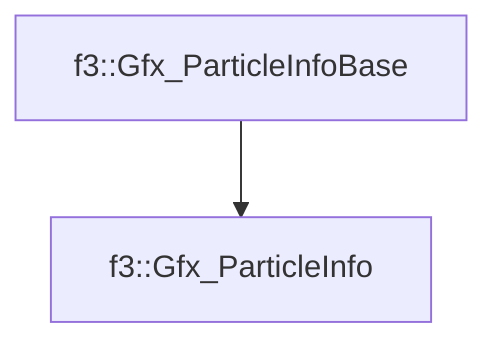

# f3::Gfx_ParticleInfo

[Return to `f3`](/docs/f3.md)

## C++

- [`Gfx_ParticleInfo.hpp`](/src/f3/Gfx_ParticleInfo.hpp)
- [`Gfx_ParticleInfo.cpp`](/src/f3/Gfx_ParticleInfo.cpp)

## References

- [`f3::Gfx_ParticleInfoBase`](/docs/f3/Gfx_ParticleInfoBase.md)

## Inheritance

[Return to `f3`](/docs/f3.md)