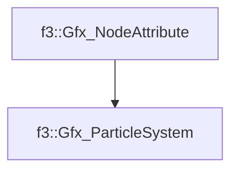

# f3::Gfx_ParticleSystem

[Return to `f3`](/docs/f3.md)

## C++

- [`Gfx_ParticleSystem.hpp`](/c++/include/Gfx_ParticleSystem.hpp)
- [`Gfx_ParticleSystem.cpp`](/c++/source/Gfx_ParticleSystem.cpp)

## References

- [`f3::Gfx_NodeAttribute`](/docs/f3/Gfx_NodeAttribute.md)

## Inheritance

[Return to `f3`](/docs/f3.md)