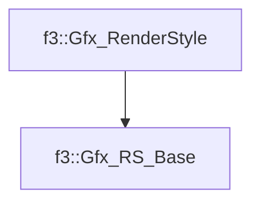

# f3::Gfx_RS_Base

[Return to `f3`](/docs/f3.md)

## C++

- [`Gfx_RS_Base.hpp`](/c++/include/Gfx_RS_Base.hpp)
- [`Gfx_RS_Base.cpp`](/c++/source/Gfx_RS_Base.cpp)

## References

- [`f3::Gfx_RenderStyle`](/docs/f3/Gfx_RenderStyle.md)

## Inheritance

[Return to `f3`](/docs/f3.md)