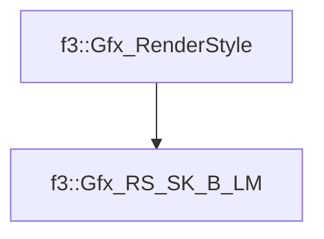

# f3::Gfx_RS_SK_B_LM

[Return to `f3`](/docs/f3.md)

## C++

- [`Gfx_RS_SK_B_LM.hpp`](/src/f3/Gfx_RS_SK_B_LM.hpp)
- [`Gfx_RS_SK_B_LM.cpp`](/src/f3/Gfx_RS_SK_B_LM.cpp)

## References

- [`f3::Gfx_RenderStyle`](/docs/f3/Gfx_RenderStyle.md)

## Inheritance

[Return to `f3`](/docs/f3.md)