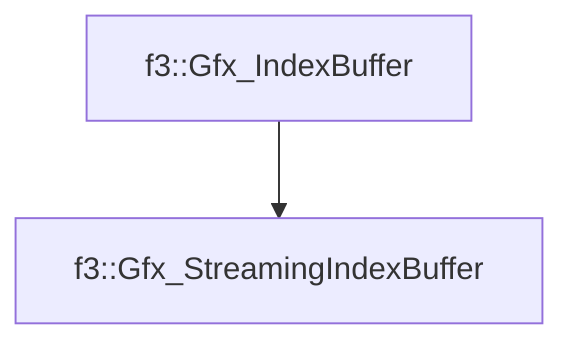

# f3::Gfx_StreamingIndexBuffer

[Return to `f3`](/docs/f3.md)

## C++

- [`Gfx_StreamingIndexBuffer.hpp`](/src/f3/Gfx_StreamingIndexBuffer.hpp)
- [`Gfx_StreamingIndexBuffer.cpp`](/src/f3/Gfx_StreamingIndexBuffer.cpp)

## References

- [`f3::Gfx_IndexBuffer`](/docs/f3/Gfx_IndexBuffer.md)

## Inheritance

[Return to `f3`](/docs/f3.md)