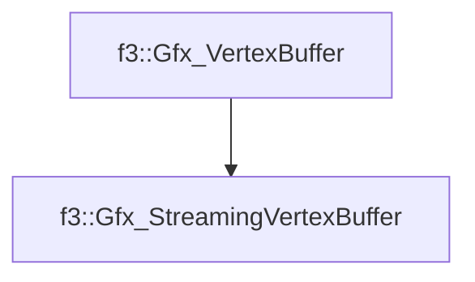

# f3::Gfx_StreamingVertexBuffer

[Return to `f3`](/docs/f3.md)

## C++

- [`Gfx_StreamingVertexBuffer.hpp`](/src/f3/Gfx_StreamingVertexBuffer.hpp)
- [`Gfx_StreamingVertexBuffer.cpp`](/src/f3/Gfx_StreamingVertexBuffer.cpp)

## References

- [`f3::Gfx_VertexBuffer`](/docs/f3/Gfx_VertexBuffer.md)

## Inheritance

[Return to `f3`](/docs/f3.md)