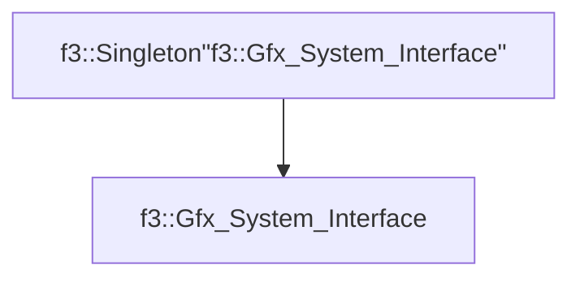

# f3::Gfx_System_Interface

[Return to `f3`](/docs/f3.md)

## C++

- [`Gfx_System_Interface.hpp`](/src/f3/Gfx_System_Interface.hpp)
- [`Gfx_System_Interface.cpp`](/src/f3/Gfx_System_Interface.cpp)

## References

- [`f3::Singleton`](/docs/f3/Singleton.md)

## Inheritance

[Return to `f3`](/docs/f3.md)