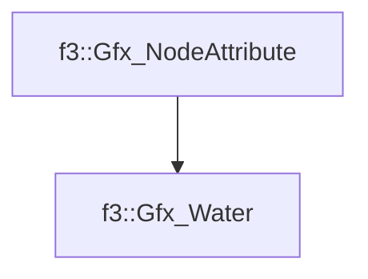

# f3::Gfx_Water

[Return to `f3`](/docs/f3.md)

## C++

- [`Gfx_Water.hpp`](/src/f3/Gfx_Water.hpp)
- [`Gfx_Water.cpp`](/src/f3/Gfx_Water.cpp)

## References

- [`f3::Gfx_NodeAttribute`](/docs/f3/Gfx_NodeAttribute.md)

## Inheritance

[Return to `f3`](/docs/f3.md)