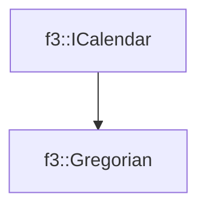

# f3::Gregorian

[Return to `f3`](/docs/f3.md)

## C++

- [`Gregorian.hpp`](/c++/include/Gregorian.hpp)
- [`Gregorian.cpp`](/c++/source/Gregorian.cpp)

## References

- [`f3::ICalendar`](/docs/f3/ICalendar.md)

## Inheritance

[Return to `f3`](/docs/f3.md)