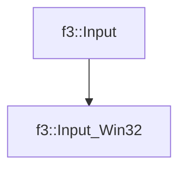

# f3::Input_Win32

[Return to `f3`](/docs/f3.md)

## C++

- [`Input_Win32.hpp`](/src/f3/Input_Win32.hpp)
- [`Input_Win32.cpp`](/src/f3/Input_Win32.cpp)

## References

- [`f3::Input`](/docs/f3/Input.md)

## Inheritance

[Return to `f3`](/docs/f3.md)