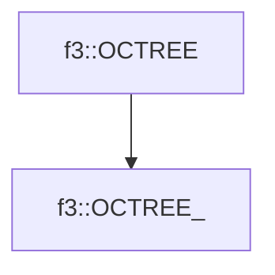

# f3::OCTREE_

[Return to `f3`](/docs/f3.md)

## C++

- [`OCTREE_.hpp`](/c++/include/OCTREE_.hpp)
- [`OCTREE_.cpp`](/c++/source/OCTREE_.cpp)

## References

- [`f3::OCTREE`](/docs/f3/OCTREE.md)

## Inheritance

[Return to `f3`](/docs/f3.md)