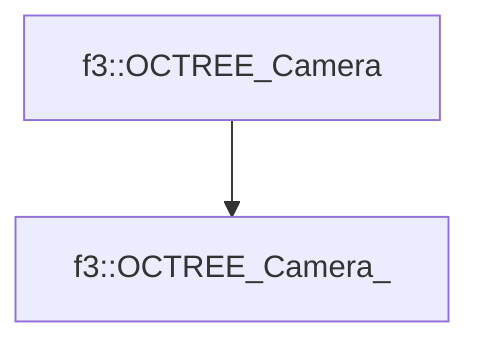

# f3::OCTREE_Camera_

[Return to `f3`](/docs/f3.md)

## C++

- [`OCTREE_Camera_.hpp`](/src/f3/OCTREE_Camera_.hpp)
- [`OCTREE_Camera_.cpp`](/src/f3/OCTREE_Camera_.cpp)

## References

- [`f3::OCTREE_Camera`](/docs/f3/OCTREE_Camera.md)

## Inheritance

[Return to `f3`](/docs/f3.md)