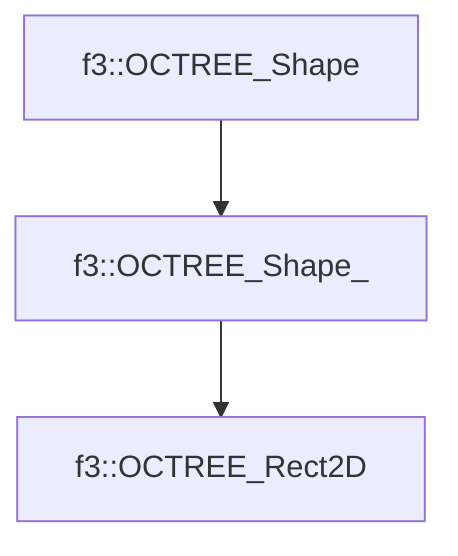

# f3::OCTREE_Rect2D

[Return to `f3`](/docs/f3.md)

## C++

- [`OCTREE_Rect2D.hpp`](/c++/include/OCTREE_Rect2D.hpp)
- [`OCTREE_Rect2D.cpp`](/c++/source/OCTREE_Rect2D.cpp)

## References

- [`f3::OCTREE_Shape`](/docs/f3/OCTREE_Shape.md)
- [`f3::OCTREE_Shape_`](/docs/f3/OCTREE_Shape_.md)

## Inheritance

[Return to `f3`](/docs/f3.md)