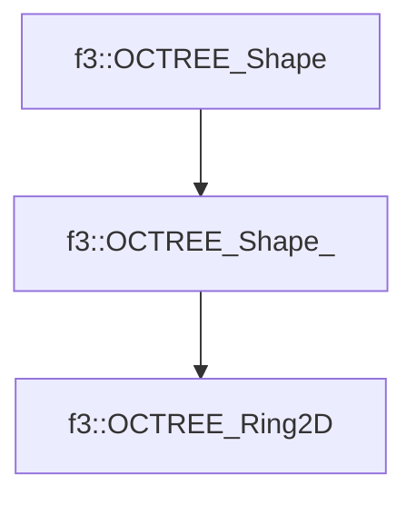

# f3::OCTREE_Ring2D

[Return to `f3`](/docs/f3.md)

## C++

- [`OCTREE_Ring2D.hpp`](/src/f3/OCTREE_Ring2D.hpp)
- [`OCTREE_Ring2D.cpp`](/src/f3/OCTREE_Ring2D.cpp)

## References

- [`f3::OCTREE_Shape`](/docs/f3/OCTREE_Shape.md)
- [`f3::OCTREE_Shape_`](/docs/f3/OCTREE_Shape_.md)

## Inheritance

[Return to `f3`](/docs/f3.md)