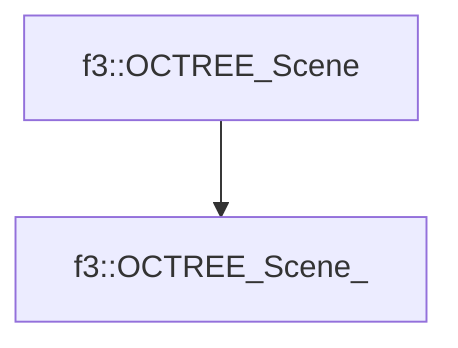

# f3::OCTREE_Scene_

[Return to `f3`](/docs/f3.md)

## C++

- [`OCTREE_Scene_.hpp`](/src/f3/OCTREE_Scene_.hpp)
- [`OCTREE_Scene_.cpp`](/src/f3/OCTREE_Scene_.cpp)

## References

- [`f3::OCTREE_Scene`](/docs/f3/OCTREE_Scene.md)

## Inheritance

[Return to `f3`](/docs/f3.md)