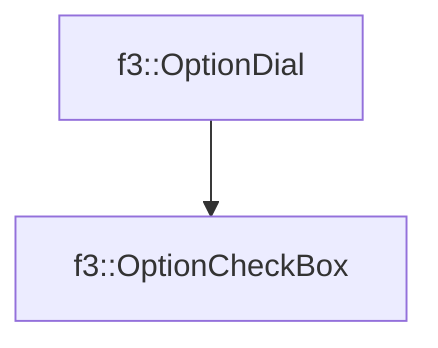

# f3::OptionCheckBox

[Return to `f3`](/docs/f3.md)

## C++

- [`OptionCheckBox.hpp`](/c++/include/OptionCheckBox.hpp)
- [`OptionCheckBox.cpp`](/c++/source/OptionCheckBox.cpp)

## References

- [`f3::OptionDial`](/docs/f3/OptionDial.md)

## Inheritance

[Return to `f3`](/docs/f3.md)