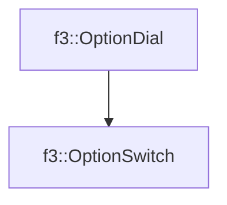

# f3::OptionSwitch

[Return to `f3`](/docs/f3.md)

## C++

- [`OptionSwitch.hpp`](/src/f3/OptionSwitch.hpp)
- [`OptionSwitch.cpp`](/src/f3/OptionSwitch.cpp)

## References

- [`f3::OptionDial`](/docs/f3/OptionDial.md)

## Inheritance

[Return to `f3`](/docs/f3.md)