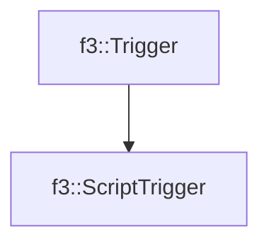

# f3::ScriptTrigger

[Return to `f3`](/docs/f3.md)

## C++

- [`ScriptTrigger.hpp`](/c++/include/ScriptTrigger.hpp)
- [`ScriptTrigger.cpp`](/c++/source/ScriptTrigger.cpp)

## References

- [`f3::Trigger`](/docs/f3/Trigger.md)

## Inheritance

[Return to `f3`](/docs/f3.md)