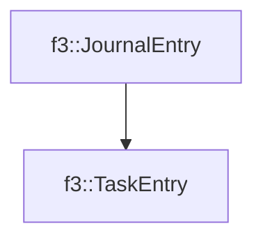

# f3::TaskEntry

[Return to `f3`](/docs/f3.md)

## C++

- [`TaskEntry.hpp`](/c++/include/TaskEntry.hpp)
- [`TaskEntry.cpp`](/c++/source/TaskEntry.cpp)

## References

- [`f3::JournalEntry`](/docs/f3/JournalEntry.md)

## Inheritance

[Return to `f3`](/docs/f3.md)