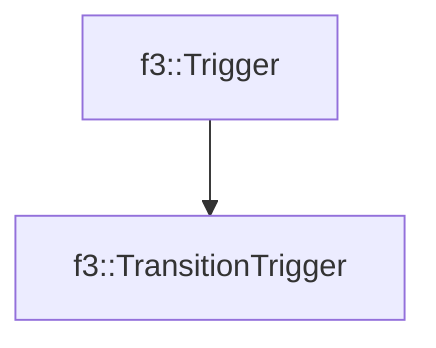

# f3::TransitionTrigger

[Return to `f3`](/docs/f3.md)

## C++

- [`TransitionTrigger.hpp`](/src/f3/TransitionTrigger.hpp)
- [`TransitionTrigger.cpp`](/src/f3/TransitionTrigger.cpp)

## References

- [`f3::Trigger`](/docs/f3/Trigger.md)

## Inheritance

[Return to `f3`](/docs/f3.md)