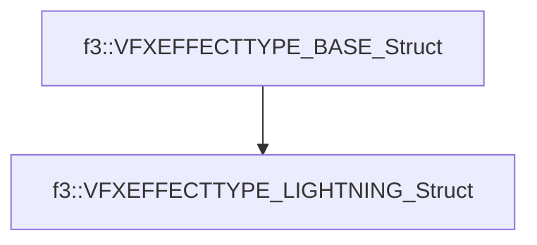

# f3::VFXEFFECTTYPE_LIGHTNING_Struct

[Return to `f3`](/docs/f3.md)

## C++

- [`VFXEFFECTTYPE_LIGHTNING_Struct.hpp`](/src/f3/VFXEFFECTTYPE_LIGHTNING_Struct.hpp)
- [`VFXEFFECTTYPE_LIGHTNING_Struct.cpp`](/src/f3/VFXEFFECTTYPE_LIGHTNING_Struct.cpp)

## References

- [`f3::VFXEFFECTTYPE_BASE_Struct`](/docs/f3/VFXEFFECTTYPE_BASE_Struct.md)

## Inheritance

[Return to `f3`](/docs/f3.md)