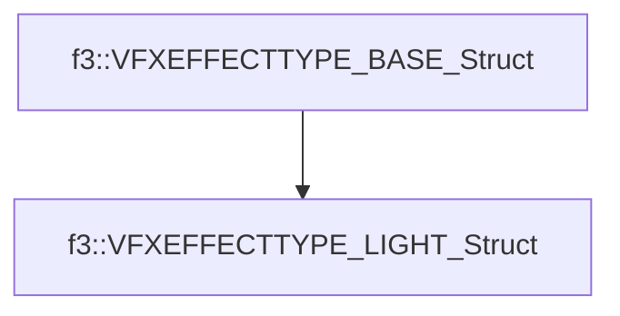

# f3::VFXEFFECTTYPE_LIGHT_Struct

[Return to `f3`](/docs/f3.md)

## C++

- [`VFXEFFECTTYPE_LIGHT_Struct.hpp`](/c++/include/VFXEFFECTTYPE_LIGHT_Struct.hpp)
- [`VFXEFFECTTYPE_LIGHT_Struct.cpp`](/c++/source/VFXEFFECTTYPE_LIGHT_Struct.cpp)

## References

- [`f3::VFXEFFECTTYPE_BASE_Struct`](/docs/f3/VFXEFFECTTYPE_BASE_Struct.md)

## Inheritance

[Return to `f3`](/docs/f3.md)