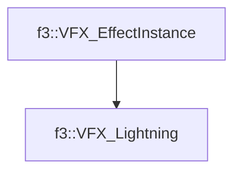

# f3::VFX_Lightning

[Return to `f3`](/docs/f3.md)

## C++

- [`VFX_Lightning.hpp`](/c++/include/VFX_Lightning.hpp)
- [`VFX_Lightning.cpp`](/c++/source/VFX_Lightning.cpp)

## References

- [`f3::VFX_EffectInstance`](/docs/f3/VFX_EffectInstance.md)

## Inheritance

[Return to `f3`](/docs/f3.md)