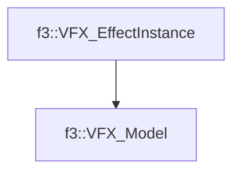

# f3::VFX_Model

[Return to `f3`](/docs/f3.md)

## C++

- [`VFX_Model.hpp`](/src/f3/VFX_Model.hpp)
- [`VFX_Model.cpp`](/src/f3/VFX_Model.cpp)

## References

- [`f3::VFX_EffectInstance`](/docs/f3/VFX_EffectInstance.md)

## Inheritance

[Return to `f3`](/docs/f3.md)