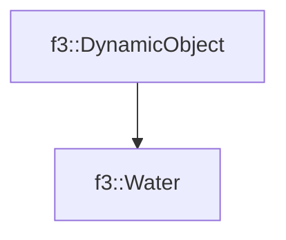

# f3::Water

[Return to `f3`](/docs/f3.md)

## C++

- [`Water.hpp`](/c++/include/Water.hpp)
- [`Water.cpp`](/c++/source/Water.cpp)

## References

- [`f3::DynamicObject`](/docs/f3/DynamicObject.md)

## Inheritance

[Return to `f3`](/docs/f3.md)