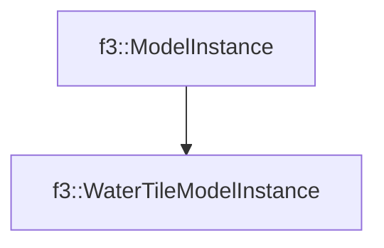

# f3::WaterTileModelInstance

[Return to `f3`](/docs/f3.md)

## C++

- [`WaterTileModelInstance.hpp`](/c++/include/WaterTileModelInstance.hpp)
- [`WaterTileModelInstance.cpp`](/c++/source/WaterTileModelInstance.cpp)

## References

- [`f3::ModelInstance`](/docs/f3/ModelInstance.md)

## Inheritance

[Return to `f3`](/docs/f3.md)