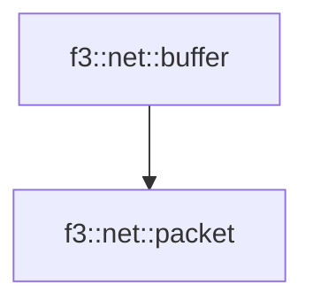

# f3::net::packet

[Return to `net`](/docs/net.md)

## References

- [`f3::net::buffer`](/docs/net/buffer.md)

## Inheritance

```mermaid
graph TD;
    f3::net::buffer --> f3::net::packet
```

[Return to `net`](/docs/net.md)